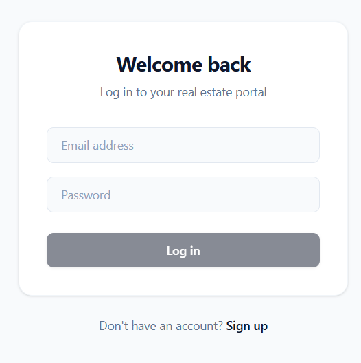
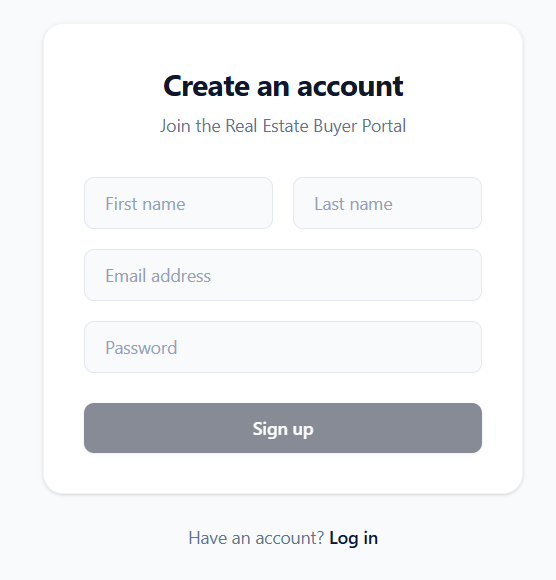
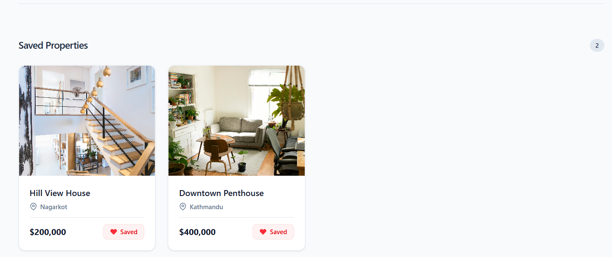

# TechKraft Real Estate Buyer Portal

A small full-stack app for real-estate buyers: **register / login** with email and password, **JWT** auth, and **saved properties** (favourites) stored per user in MongoDB.

## 📸 Screenshots

### 🔐 Login Page


### 📝 Register Page


### 🏠 Dashboard



## Prerequisites

- [Node.js](https://nodejs.org/) (LTS recommended)
- [MongoDB](https://www.mongodb.com/) running locally or a connection string to Atlas

## Project structure

```
Techkraft Buyer Portal/
├── client/    # React (Vite) frontend
└── server/    # Express + Mongoose API
```

## 1. Configure the server

Create `server/.env` (copy the template below and adjust values):

```env
# MongoDB connection string
MONGO_URI=mongodb://127.0.0.1:27017/techkraft-buyer-portal

# Secret for signing JWTs (use a long random string in production)
JWT_SECRET=your-secret-key-change-me

# API port (the client is coded to call http://localhost:5000)
PORT=5000

# Vite dev server origin — must match the URL you open in the browser (CORS)
CLIENT_URL=http://localhost:5173
```

Install dependencies and start the API:

```bash
cd server
npm install
npm start
```

You should see MongoDB connected and the server listening (e.g. `http://localhost:5000`).

## 2. Run the client

In a **second** terminal:

```bash
cd client
npm install
npm run dev
```

Open the URL Vite prints (usually **http://localhost:5173**). If you use another port, set `CLIENT_URL` in `server/.env` to that exact origin and restart the server.

## 3. Sample data (properties)

The dashboard loads **available properties** from the database. If the list is empty, add documents to the `properties` collection (e.g. with [MongoDB Compass](https://www.mongodb.com/products/compass) or `mongosh`) with at least: `title`, `price`, `location`, `image` (URL string), matching the `Property` model in `server/src/models/Property.js`.

## Example flows

### Sign up → dashboard

1. Go to **Register** (`/register`).
2. Fill first name, last name, email, password.
3. Submit. You are logged in (token stored) and redirected to the home **Dashboard**.
4. You should see your **name** and **role** (default `buyer`) and, if any exist, **Available Properties** and **Saved Properties**.

### Login

1. Open **Login** (`/login`).
2. Enter email and password.
3. After success, you land on the **Dashboard** with your session restored via `localStorage`.

### Add and remove a favourite

1. While logged in, on the Dashboard find **Available Properties**.
2. Click **Save** on a property to add it to your favourites.
3. It appears under **Saved Properties**.
4. Click **Remove** on a saved card to remove it from your favourites.

Only the **authenticated user** can see or change their own favourites; the API uses the JWT to load the correct user.

### Logout

Use **Logout** on the dashboard. You can sign in again from `/login`.
